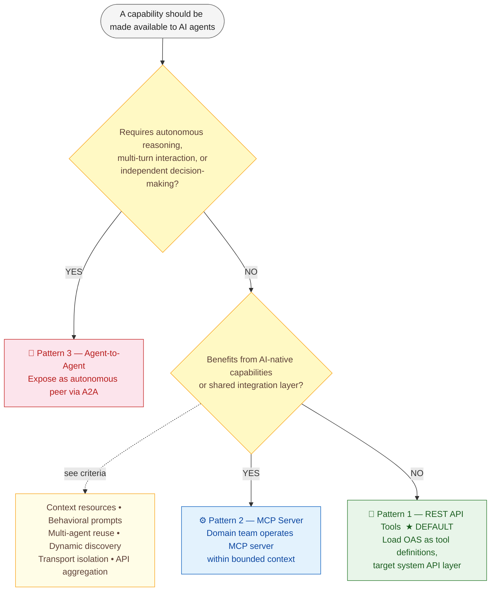
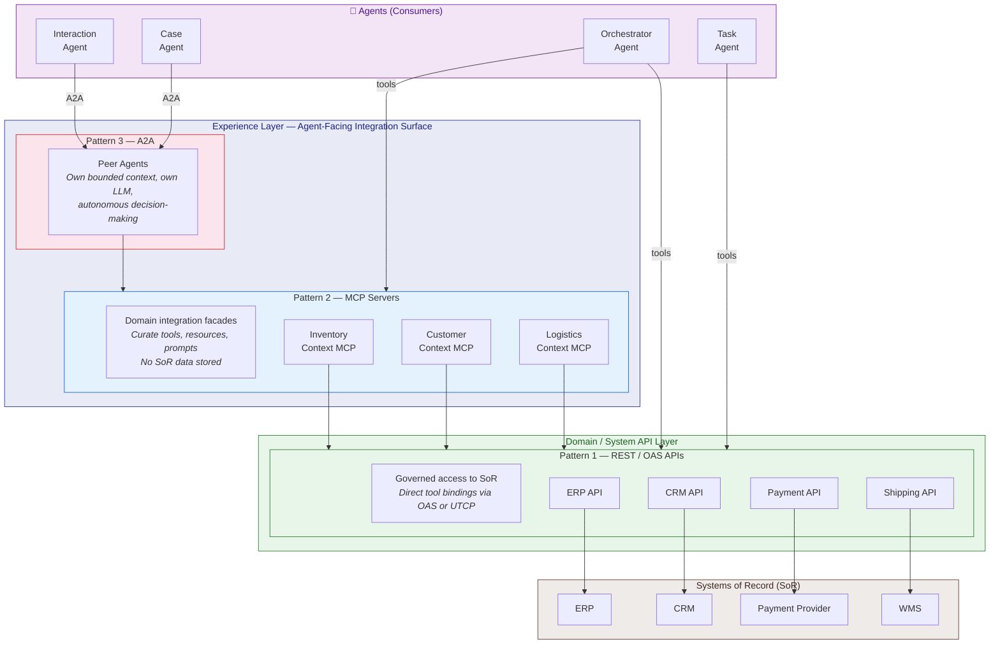

# Agentic Integration Patterns
## Decision Framework

| | |
|:--|:--|
| **Status** | Draft |
| **Date** | May 2026 |

---

**Contents**

1. [Purpose](#1-purpose)
2. [Foundational Concept: Systems of Record](#2-foundational-concept-systems-of-record)
3. [Enterprise Agent Taxonomy](#3-enterprise-agent-taxonomy)
4. [Three Integration Patterns](#4-three-integration-patterns)
5. [Decision Tree](#5-decision-tree)
6. [Layered Architecture — DDD, API Tiers, and Systems of Record](#6-layered-architecture--ddd-api-tiers-and-systems-of-record)
7. [Governance and Ownership](#7-governance-and-ownership)
8. [Anti-Patterns to Avoid](#8-anti-patterns-to-avoid)

---

## 1. Purpose

This document provides a decision framework for teams integrating AI agents into the enterprise landscape. It defines **three integration patterns**, clarifies when each applies, and maps them to our enterprise agent taxonomy. The goal is to reduce architectural ambiguity and establish clear guidelines.

---

## 2. Foundational Concepts

### 2.1: Systems of Record

Before discussing integration patterns, teams must internalize the concept that underpins all enterprise data architecture: the **System of Record (SoR)**.

A [System of Record](https://www.ibm.com/think/topics/system-of-record) is the **authoritative source** for a specific category of business data — customers, products, orders, employees, financial transactions. Examples include CRM, ERP, HCM, and specialized vertical systems. The SoR is where the *golden record* lives: the most up-to-date, validated, and governed version of the data.

### Why SoR Matters for Agentic Integration

Agents are fundamentally **consumers and mutators of SoR data**. Every agent action that reads a customer profile, creates an order, or updates a case ultimately touches a System of Record. This has three critical implications:

1. **Data integrity must be preserved.** SoRs enforce validation rules, referential integrity, and business constraints. Agents must access SoRs through governed APIs (system APIs) that preserve these guarantees — never through direct database access or unvalidated side channels.

2. **The SoR is the single source of truth, not the agent.** Agents may cache, summarize, or transform SoR data for their reasoning context (e.g., via MCP Resources). But the agent's internal state is **never authoritative**. If an agent and the SoR disagree, the SoR wins.

3. **Write operations require governance.** When an agent writes back to a SoR (creating a customer, updating an address, approving a claim), the write must flow through the same governed API layer that human-initiated writes use — with identical validation, audit trails, and access controls.

> [!IMPORTANT]
> **Agents must never become shadow Systems of Record.** If an agent stores data locally, caches derived state, or maintains its own "source of truth" that diverges from the SoR, the enterprise loses data integrity. Agent state is ephemeral; SoR state is authoritative.

---

### 2.2: Enterprise Agent Taxonomy

Before selecting an integration pattern, teams must understand the four categories of agents operating in the enterprise. Each category has different integration needs.

| Category | Role | Key Characteristics |
|:---------|:-----|:--------------------|
| **Interaction Agent** | Customer-facing conversational agent (chat, voice, self-service portal) | Multi-turn dialogue, stateful sessions, user-facing UX, requires guardrails and brand tone enforcement |
| **Case Agent** | Manages a case lifecycle (support ticket, claims process, onboarding) | Long-running, stateful, handles interruptions and resumptions, owns case context |
| **Orchestrator Agent** | Decomposes high-level goals into sub-tasks, coordinates other agents | Hierarchical delegation, shared context with sub-agents, planning and sequencing |
| **Task Agent** | Executes a discrete, well-bounded function | Stateless or short-lived, reusable across contexts, atomic input/output contract |

> [!IMPORTANT]
> The agent category determines the integration pattern, not the other way around. Start by identifying what kind of agent you are building or connecting to, then use the decision tree below.

---

## 3. Three Integration Patterns

| | 🔧 Pattern 1 — REST API Tools | ⚙️ Pattern 2 — MCP Servers | 🤝 Pattern 3 — Agent-to-Agent |
|:--|:--|:--|:--|
| **Role** | Default integration path | AI-native integration layer | Autonomous peer collaboration |
| **Mechanism** | OAS loaded as tool definitions; agents call REST endpoints directly via generated wrappers | Remote MCP servers expose tools, resources, and prompts discovered dynamically at runtime | Agents exposed as autonomous endpoints; interaction via multi-turn task-based messaging (e.g. A2A protocol) |
| **Scope** | Within a bounded context | Within a bounded context | Across bounded contexts |
| **Relationship to SoR** | Direct, governed access via system APIs | Facade above system APIs — routes writes through them; stores no authoritative data | Each agent maintains its own SoR relationships within its context |
| **Interaction model** | Stateless, discrete tool calls | Stateless or session-based tool/resource calls | Multi-turn, stateful, non-deterministic completion |
| **Maturity** | Established — broad tooling support | Emerging — growing ecosystem | Early — protocol standards still evolving |
| **Primary use case** | Simple CRUD, stable schemas, direct data access | Context aggregation, multi-service orchestration, AI-optimized views | Complex problem-solving requiring autonomy, judgment, or cross-context dialogue |

### 3.1 Pattern 1 — REST API Tools (Default)

**Mechanism:** OpenAPI Specifications (OAS) are loaded directly as tool definitions. Agents call structured REST endpoints via generated tool wrappers (e.g., Google ADK OpenAPI tools). UTCP (Universal Tool Calling Protocol) may extend this pattern with tool discovery capabilities.

**Scope:** System API layer — the governed APIs that provide canonical access to Systems of Record. These APIs already exist in the enterprise, enforce data validation and integrity, and are the authoritative interface to SoR data.

**When to use:**
- The capability is a **deterministic, stateless operation** (CRUD, lookup, calculation) against a SoR
- A well-maintained **contract (usually OAS) already exists** and is stable
- The agent needs **transactional access** to a System of Record with full validation and audit trail
- No AI-specific context enrichment or behavioral shaping is required
- The integration is a **1:1 mapping** between agent action and API endpoint

**Characteristics:**

| Aspect | Detail |
|:-------|:-------|
| Control flow | Caller retains full control |
| I/O contract | Strictly structured (JSON Schema via OAS) |
| State | Stateless — each call is independent |
| Discoverability | Static — OAS injected at build/deploy time |
| Operational ownership | API team owns the endpoint; agent team owns the tool wrapper |

#### UTCP as a Pattern 1 Extension

[UTCP (Universal Tool Calling Protocol)](https://www.utcp.io/) extends Pattern 1 with agent-discoverable tool definitions — without introducing a middleman server. A lightweight discovery endpoint (`GET /utcp`) describes how to call existing APIs directly; agents then call those endpoints natively, reusing existing auth and incurring no additional infrastructure or proxy overhead.

Where Pattern 1 with plain OAS is static (definitions are injected at build time), UTCP adds runtime discoverability while keeping the direct-call model intact. For a detailed comparison with Pattern 2 (MCP), see [Section 4.2](#42-pattern-2--mcp-servers-ai-native-integration-layer) and [utcp.io/utcp-vs-mcp](https://www.utcp.io/utcp-vs-mcp).

**Pattern 1 the organizational default.** Most system integrations should start here. Only escalate to Pattern 2 or 3 when the limitations of direct REST become an active constraint.

---

### 3.2 Pattern 2 — MCP Servers (AI-Native Integration Layer)

**Mechanism:** Teams operate remote MCP servers within their bounded context. Agents connect via the Model Context Protocol and discover tools, resources, and prompts dynamically at runtime.

**Scope:** Within domains / bounded contexts (DDD). The MCP server is owned and operated by the domain team.

**When to use — escalate from Pattern 1 when ANY of the following apply:**

1. **Separation of concerns is violated.** The agent prompt could be polluted with transport details (base URLs, auth headers, error parsing, multi-service orchestration). MCP enforces a clean Host → Client → Server architecture that keeps the agent's reasoning layer free of infrastructure concerns.

2. **Context bloat from OAS injection.** The OpenAPI spec consumes significant context window budget. A typical OAS is ~5,500 characters for just 5 endpoints — at scale across dozens of microservices, this becomes untenable. MCP's `list_tools` provides curated, minimal, semantic tool definitions fetched live.

3. **The agent needs contextual data, not just transactions.** REST APIs are transactional (CRUD). But agents often need **background context** before acting — e.g., a pre-formatted inventory summary, a customer risk profile, a domain state overview. MCP Resources (`catalog://summary`) provide first-class contextual data streams with no REST equivalent.

4. **Behavioral guardrails must be enforced at the platform level.** Enterprise standards for tone, language, compliance rules, or output formatting should not depend on prompt engineering. MCP Prompts provide backend-managed behavioral templates (e.g., `draft_loyalty_email`) that enforce business logic at the server, not the agent.

5. **Multiple agents consume the same backend.** Without MCP, each agent independently implements tool definitions, HTTP clients, auth, error handling, and schema migration. A centralized MCP server acts as a shared, governed tool registry — write once, connect many. Schema changes propagate automatically on the next `list_tools` call.

6. **API schemas evolve frequently.** Static OAS injection goes stale. MCP tool definitions are fetched dynamically at connection time — never stale, always reflecting the live API contract.

**Characteristics:**

| Aspect | Detail |
|:-------|:-------|
| Control flow | Caller retains control; server is a tool provider |
| I/O contract | Semantic tool primitives (not HTTP verbs) |
| State | Server may maintain session state; supports stateful resources |
| Discoverability | Dynamic — `list_tools` at connection time |
| Primitives | Tools, Resources, Prompts (no REST equivalent for the latter two) |
| Operational ownership | Domain team owns and operates the MCP server |

> [!TIP]
> MCP servers should be scoped to a **bounded context**, not to an individual microservice. A single MCP server can aggregate multiple backend APIs (e.g., Products API + Customers API) into a unified, curated tool surface for agents.

---

### 3.3 Pattern 3 — Agent-to-Agent (Agents as Autonomous Peers)

**Mechanism:** Teams expose agents directly as integration endpoints. Other agents interact with them as autonomous peers — not as tools, not as functions. This requires a fundamentally different interaction model (e.g., A2A protocol, multi-turn task-based messaging).

**Scope:** Across bounded contexts, or within complex orchestration scenarios where the receiving agent requires autonomy.

> [!WARNING]
> **Agents are not tools.** This is the critical architectural distinction. Treating an agent as a tool (structured input → structured output, guaranteed completion) breaks down when the agent needs to:
> - Request additional information from the caller
> - Handle ambiguity and negotiate solutions
> - Manage interrupted or never-completed actions
> - Exercise autonomous judgment based on its own environment and knowledge
>
> — Philip Stephens, [*Agents are not tools*](https://discuss.google.dev/t/agents-are-not-tools/192812), Google Developer Knowledge Hub

**The fundamental difference:**

| | Tool (Pattern 1 & 2) | Agent (Pattern 3) |
|:--|:---------------------|:------------------|
| **Interaction** | Request → Response (single turn) | Multi-turn, iterative problem solving |
| **Completion** | Guaranteed: success or error | Not guaranteed: may be interrupted, incomplete, or abandoned |
| **I/O domain** | Bounded: `ƒ(x ∈ 𝒟) → y ∈ ℝ` | Effectively unbounded: natural language + structured data |
| **Control flow** | Caller retains control | Control may transfer; agent has autonomy |
| **State** | Stateless or caller-managed | Agent manages its own state; may require resumption |
| **Error model** | Binary: success/failure | Nuanced: needs info, blocked, partially complete, suggestion |

**When to use:**

1. **The capability requires autonomous problem-solving.** The receiving agent must exercise judgment, handle ambiguity, or negotiate with the caller. Example: a Case Agent that may need to request proof of address, suggest alternatives, or surface decisions to a human.

2. **Multi-turn interaction is inherent to the task.** The work cannot be reduced to a single request/response. Example: a travel planning agent that iteratively refines constraints across flights, hotels, and activities through multiple exchanges.

3. **The receiving agent owns its own decision-making context.** It has access to information, policies, or environmental factors that the caller cannot (and should not) supply. Example: a compliance review agent that applies regulatory knowledge to assess a proposed action.

4. **Control flow transfer is acceptable.** The caller is willing to delegate a sub-problem and accept that completion is not guaranteed. This is analogous to the `GOTO` construct — powerful but must be isolated to well-defined boundaries.

**Mapping to the enterprise agent taxonomy (Section 3):**

| Agent Category | Typical Integration Pattern | Rationale |
|:---------------|:---------------------------|:----------|
| **Interaction Agent** | Exposed via A2A (Pattern 3) | Multi-turn dialogue, session state, unpredictable conversation flow |
| **Case Agent** | Exposed via A2A (Pattern 3) | Long-running lifecycle, interruptions, resumptions, autonomous decisions |
| **Orchestrator Agent** | Consumes Patterns 1, 2, and 3 | Delegates to task agents and peer agents; manages the plan |
| **Task Agent** | See guidance below | Not every discrete task needs an agent — distinguish carefully |

#### When to build a Task Agent vs. when a Tool is sufficient

A common over-engineering mistake is wrapping a simple API call in an agent. Task agents carry overhead (LLM inference, prompt management, observability) that is only justified when the task requires **reasoning**, not just execution.

| Build a **Tool** (Pattern 1 or 2) when… | Build a **Task Agent** when… |
|:-----------------------------------------|:------------------------------|
| The task is a deterministic function: input → output | The task requires **multi-step reasoning** to produce a result |
| The logic can be fully expressed in code (no LLM needed) | The task involves **LLM judgment** — e.g., classification, summarization, NL2SQL |
| The contract is strict and well-defined (JSON Schema) | The task needs to **select and sequence** its own tools dynamically |
| Examples: fetch a record, run a calculation, validate input | Examples: analyze a document, generate a report, translate with domain context |

> [!IMPORTANT]
> **Default to tools.** A task agent is warranted only when the task itself requires an LLM reasoning loop. If the capability can be expressed as a deterministic function — even a complex one — expose it as a tool via Pattern 1 (REST) or Pattern 2 (MCP), not as an agent.

> [!NOTE]
> **The "agent as tool" anti-pattern** occurs when a Case Agent or Interaction Agent — which inherently requires multi-turn, autonomous problem solving — is forced behind a tool interface. This creates fragile workarounds: error codes abused for control flow, overloaded response schemas, and lost session state. Use Pattern 3 for these agents.

---

## 4. Decision Tree

Use this flowchart when selecting an integration pattern for a new agentic integration.

---

## 5. Layered Architecture — DDD, API Tiers, and Systems of Record

### 5.1 Enterprise API Layering

Enterprise integration architectures traditionally organize APIs into layers. Agentic integration patterns must respect and extend — not bypass — this established structure:

| Layer | Purpose | SoR Relationship | Examples |
|:------|:--------|:-----------------|:---------|
| **System API** | Canonical, stable access to a [System of Record](https://www.ibm.com/think/topics/system-of-record). One API per SoR. Enforces validation, referential integrity, and audit trails. | **Direct** — the governed gateway to SoR data. All reads and writes to the golden record flow through this layer. | `ERP Product API`, `CRM Contact API`, `Payment Gateway API` |
| **Domain API** (Process API) | Composes system APIs into domain-meaningful operations. Encapsulates business logic within a [bounded context](https://martinfowler.com/bliki/BoundedContext.html). | **Mediated** — orchestrates operations across one or more SoRs within the domain's consistency boundary. | `Order Fulfillment API`, `Claims Processing API`, `Inventory Management API` |
| **Experience API** (Agent-facing) | Tailored for a specific consumer. In the agentic world: curated tool surfaces, contextual resources, behavioral prompts. | **Derived** — provides read-optimized, context-enriched views of SoR data. Writes are proxied back through system/domain APIs. | MCP servers, A2A agent endpoints, BFF APIs |

> [!IMPORTANT]
> **Pattern 1 (REST tools) targets the System and Domain API layers** — the governed path to Systems of Record. Pattern 2 (MCP) operates at the **Domain/Experience boundary** — it is not a peer of REST but a facade *above* it that provides AI-optimized views of SoR data. Pattern 3 (A2A) is a peer-to-peer concern that crosses bounded contexts entirely.

### 5.2 Where Patterns Live in the Stack

### 5.3 Key Layering Rules

1. **Agents never bypass the system API layer.** No direct database connections, no internal service calls. All access to Systems of Record goes through governed system APIs — existing infrastructure that enforces validation, audit, and access control. This rule applies equally to AI agents and human-initiated processes.

2. **The System of Record is the single source of truth — always.** Agents may cache, summarize, or transform SoR data (e.g., MCP Resources providing a pre-formatted inventory summary). But the agent's internal state is never authoritative. Stale agent context must never override current SoR data.

3. **Write operations follow the same governance path as non-agentic writes.** When an agent creates a customer, updates an address, or approves a claim, the write must flow through the system API layer with identical validation, business rules, and audit trails that apply to UI- or service-initiated writes. There is no "agent fast lane" that bypasses data governance.

4. **MCP servers are domain integration facades, not Systems of Record.** An MCP server does not *replace* a REST API, nor does it store authoritative data. It sits above one or more system/domain APIs and curates an AI-optimized view: semantic tools, contextual resources, behavioral prompts. This is analogous to how a BFF (Backend-for-Frontend) adapts APIs for a UI — the MCP server is a *Backend-for-Agent*.

5. **One MCP server per bounded context, not per microservice.** In DDD terms, a bounded context defines a [Ubiquitous Language](https://martinfowler.com/bliki/UbiquitousLanguage.html) and a consistency boundary. The MCP server should mirror this boundary. Example: an *Inventory Context MCP* aggregates the Products API and Warehouse API, exposing a unified tool surface using inventory domain language — not product-database language.

6. **Pattern 1 may target system APIs or domain APIs.** When a domain API already provides the right level of abstraction and its OAS is stable, agents can bind directly to it via Pattern 1. MCP (Pattern 2) is warranted only when the escalation criteria from Section 4.2 apply.

7. **A2A (Pattern 3) is a cross-context concern.** When an agent in one bounded context needs to interact with an agent in another bounded context, neither tools nor MCP apply — the interaction is peer-to-peer, multi-turn, and crosses linguistic (ubiquitous language) boundaries. Each agent maintains its own SoR relationships within its own bounded context.

### 5.4 DDD Alignment

The three integration patterns map directly to DDD strategic design concepts:

| DDD Concept | Agentic Integration Pattern | Relationship |
|:------------|:---------------------------|:-------------|
| **Bounded Context** | MCP Server (Pattern 2) | The MCP server defines the AI-facing boundary of a bounded context. Its tools use the context's ubiquitous language. |
| **Context Map** | The set of all agent integration points | Patterns 1, 2, and 3 together form the enterprise's agentic context map — how bounded contexts expose capabilities to agents and to each other. |
| **Published Language** | OAS (Pattern 1), MCP tool schemas (Pattern 2) | The structured contracts agents use to interact with a bounded context. |
| **Anti-Corruption Layer** | MCP Server (Pattern 2) | The MCP server translates between the domain's internal model and the agent's reasoning model — preventing system-level concerns from corrupting the agent's context. |
| **Open Host Service** | REST API (Pattern 1), MCP Server (Pattern 2) | The publicly available, well-defined interface a bounded context offers to its consumers. |
| **Separate Ways** | Agent-to-Agent (Pattern 3) | When two bounded contexts cannot be integrated via shared tools, their agents interact as autonomous peers with independent models. |

> [!TIP]
> **The anti-corruption layer role of MCP is its most important DDD function.** Without it, agents must reason about system-level schemas (database column names, HTTP error codes, internal IDs) — leaking SoR implementation details into the reasoning layer. The MCP server absorbs this translation, presenting domain-meaningful abstractions to the agent while routing writes back through the governed system API layer.

**Key architectural principle:** As you move from Pattern 1 → 2 → 3, you trade **simplicity and control** for **flexibility and autonomy**. Always default to the simplest pattern that satisfies the requirements — and always ensure that the System of Record remains the authoritative data source at every layer.

---

## 6. Governance and Ownership

| Concern | Pattern 1 (REST) | Pattern 2 (MCP) | Pattern 3 (A2A) |
|:--------|:-----------------|:-----------------|:-----------------|
| **Who owns the endpoint?** | Product Team (existing) | Product Team / Domain (new MCP server) | Agent team |
| **SoR authority** | Direct — system API is the governed interface to the SoR | Proxied — MCP routes writes through system APIs; stores no authoritative data | Each agent manages its own SoR relationships |
| **Change propagation** | Manual OAS re-injection | Automatic via `list_tools` | Agent handles internally |
| **Auth & access control** | API gateway (existing) | MCP gateway | A2A protocol / agent identity |
| **Observability** | API metrics (existing) | MCP server telemetry (new) | Agent-level tracing (new) |
| **Blast radius of change** | All agents using stale OAS | Contained to MCP server consumers | Contained to agent's peers |

---

## 7. Anti-Patterns to Avoid

| Anti-Pattern | Description | Correct Pattern |
|:-------------|:------------|:----------------|
| **OAS bloat** | Injecting 50+ endpoint OAS specs into agent context | Pattern 2: MCP server curates and distills tool surface |
| **Agent-as-tool** | Wrapping a Case Agent behind a synchronous tool interface, abusing error codes for "needs more info" | Pattern 3: Expose as autonomous peer with multi-turn protocol |
| **MCP for everything** | Building MCP servers for simple, stable CRUD that already has a good OAS | Pattern 1: Use direct REST tools |
| **Monolith MCP** | One MCP server aggregating all enterprise APIs | Pattern 2: Scope to bounded context |
| **Skipping the system layer** | Agents calling databases or internal services directly, bypassing SoR validation and audit | Pattern 1: All SoR access goes through system APIs |
| **Agent as shadow SoR** | Agent maintains its own persistent state that diverges from the System of Record (e.g., local cache treated as truth, agent-managed customer lists) | Agent state is ephemeral; the SoR is always authoritative. Sync back through system APIs. |
| **Ungoverned agent writes** | Agent writes to a SoR through a path that bypasses validation, audit trails, or access controls that apply to human-initiated writes | Route all writes through the same governed system API layer. No "agent fast lane." |
| **Stateless peer agents** | Using A2A for what is effectively a function call | Pattern 1 or 2: Use tools for discrete actions |

---

## References

| # | Source | Description |
|:-:|:-------|:------------|
| 1 | [What is a System of Record?](https://www.ibm.com/think/topics/system-of-record) | IBM Think — Authoritative SoR definition and enterprise data governance context |
| 2 | [Why MCP over Direct REST API Access for Agentic AI](mcp_advantages.md) | Internal — Reference implementation analysis comparing MCP and REST for agents |
| 3 | [Where to use sub-agents versus agents as tools](https://cloud.google.com/blog/topics/developers-practitioners/where-to-use-sub-agents-versus-agents-as-tools/?hl=en) | Google Cloud Blog — Decision framework for sub-agent vs. tool architecture |
| 4 | [Agents are not tools](https://discuss.google.dev/t/agents-are-not-tools/192812) | Google Developer Knowledge Hub — Philip Stephens on the agent/tool distinction |
| 5 | [Domain-Driven Design](https://martinfowler.com/bliki/DomainDrivenDesign.html) | Martin Fowler — See also [Bounded Context](https://martinfowler.com/bliki/BoundedContext.html), [Ubiquitous Language](https://martinfowler.com/bliki/UbiquitousLanguage.html) |
| 6 | [UTCP vs MCP](https://www.utcp.io/utcp-vs-mcp) | utcp.io — Protocol comparison: Universal Tool Calling Protocol vs. MCP |
| 7 | [Model Context Protocol Specification](https://spec.modelcontextprotocol.io/) | Official MCP specification |
| 8 | [Google ADK Multi-Agent Reference Architecture](https://cloud.google.com/architecture/multiagent-ai-system) | Google Cloud — Multi-agent system design patterns |

---
