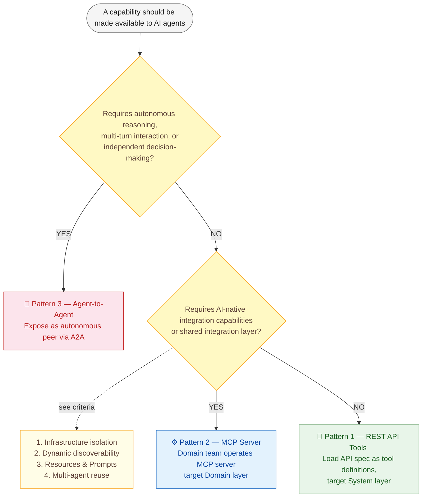
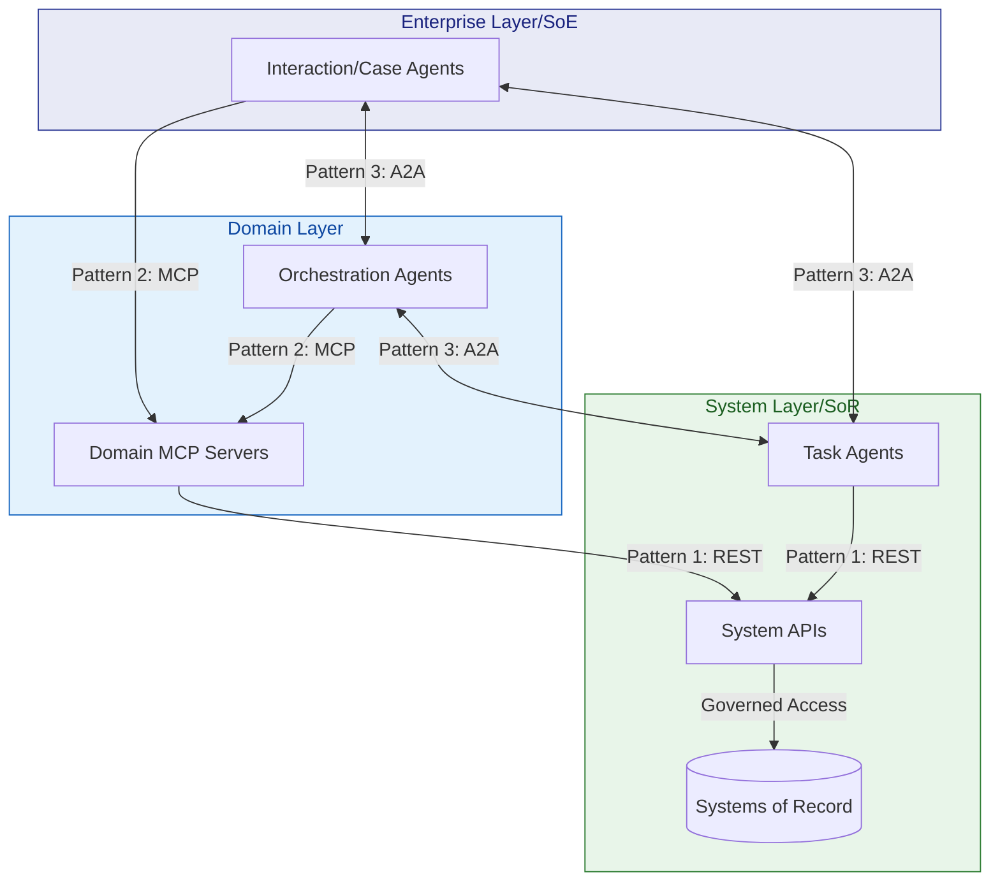

# Agentic Integration Patterns
## Decision Framework

| | |
|:--|:--|
| **Status** | Draft |
| **Date** | May 2026 |

---

**Contents**

1. [Purpose](#1-purpose)
2. [Foundational Concept: Systems of Record](#2-foundational-concept-systems-of-record)
3. [Enterprise Agent Taxonomy](#3-enterprise-agent-taxonomy)
4. [Three Integration Patterns](#4-three-integration-patterns)
5. [Decision Tree](#5-decision-tree)
6. [Layered Architecture — DDD, API Tiers, and Systems of Record](#6-layered-architecture--ddd-api-tiers-and-systems-of-record)
7. [Governance and Ownership](#7-governance-and-ownership)
8. [Anti-Patterns to Avoid](#8-anti-patterns-to-avoid)

---

## 1. Purpose

This document provides a decision framework for teams integrating AI agents into the enterprise landscape. It defines **three integration patterns**, clarifies when each applies, and maps them to our enterprise agent taxonomy. The goal is to reduce architectural ambiguity and establish clear guidelines.

---

## 2. Foundational Concepts

### 2.1: Systems of Record

Before discussing integration patterns, teams must internalize the concept that underpins all enterprise data architecture: the **System of Record (SoR)**.

A [System of Record](https://www.ibm.com/think/topics/system-of-record) is the **authoritative source** for a specific category of business data — customers, products, orders, employees, financial transactions. Examples include CRM, ERP, HCM, and specialized vertical systems. The SoR is where the *golden record* lives: the most up-to-date, validated, and governed version of the data.

### Why SoR Matters for Agentic Integration

Agents are fundamentally **consumers and mutators of SoR data**. Every agent action that reads a customer profile, creates an order, or updates a case ultimately touches a System of Record. This has three critical implications:

1. **Data integrity must be preserved.** SoRs enforce validation rules, referential integrity, and business constraints. Agents must access SoRs through governed APIs (system APIs) that preserve these guarantees — never through direct database access or unvalidated side channels.

2. **The SoR is the single source of truth, not the agent.** Agents may cache, summarize, or transform SoR data for their reasoning context (e.g., via MCP Resources). But the agent's internal state is **never authoritative**. If an agent and the SoR disagree, the SoR wins.

3. **Write operations require governance.** When an agent writes back to a SoR (creating a customer, updating an address, approving a claim), the write must flow through the same governed API layer that human-initiated writes use — with identical validation, audit trails, and access controls.

> [!IMPORTANT]
> **Agents must never become shadow Systems of Record.** If an agent stores data locally, caches derived state, or maintains its own "source of truth" that diverges from the SoR, the enterprise loses data integrity. Agent state is ephemeral; SoR state is authoritative.

---

### 2.2: Enterprise Agent Taxonomy

Before selecting an integration pattern, teams must understand the four categories of agents operating in the enterprise. Each category has different integration needs.

| Category | Role | Key Characteristics |
|:---------|:-----|:--------------------|
| **Interaction Agent** | Customer-facing conversational agent (chat, voice, self-service portal) | Multi-turn dialogue, stateful sessions, user-facing UX, requires guardrails and brand tone enforcement |
| **Case Agent** | Manages a case lifecycle (support ticket, claims process, onboarding) | Long-running, stateful, handles interruptions and resumptions, owns case context |
| **Orchestrator Agent** | Decomposes high-level goals into sub-tasks, coordinates other agents | Hierarchical delegation, shared context with sub-agents, planning and sequencing |
| **Task Agent** | Executes a discrete, well-bounded function | Stateless or short-lived, reusable across contexts, atomic input/output contract |

---

## 3. Three Integration Patterns

| | 🔧 Pattern 1 — REST API Tools | ⚙️ Pattern 2 — MCP Servers | 🤝 Pattern 3 — Agent-to-Agent |
|:--|:--|:--|:--|
| **Role** | Default integration path | AI-native integration layer | Autonomous peer collaboration |
| **Mechanism** | OAS loaded as tool definitions; agents call REST endpoints directly via generated wrappers | Remote MCP servers expose tools, resources, and prompts discovered dynamically at runtime | Agents exposed as autonomous endpoints; interaction via multi-turn task-based messaging (e.g. A2A protocol) |
| **Scope** | Within a bounded context | Within a bounded context | Within or across bounded contexts |
| **Relationship to SoR** | Direct, governed access via system APIs | Facade above system APIs — routes writes through them; stores no authoritative data | Each agent maintains its own SoR relationships within its context |
| **Interaction model** | Stateless, discrete tool calls | Stateless or session-based tool/resource calls | Multi-turn, stateful, non-deterministic completion |
| **Maturity** | Established — broad tooling support | Emerging — growing ecosystem | Early — protocol standards still evolving |
| **Primary use case** | Simple CRUD, stable schemas, direct data access | Context aggregation, multi-service orchestration, AI-optimized views | Complex problem-solving requiring autonomy, judgment, or cross-context dialogue |

### 3.1 Pattern 1 — REST API Tools (Default)

**Mechanism:** OpenAPI Specifications (OAS) are loaded directly as tool definitions. Agents call structured REST endpoints via generated tool wrappers (e.g., Google ADK OpenAPI tools). UTCP (Universal Tool Calling Protocol) may extend this pattern with tool discovery capabilities.

**Scope:** System API layer — the governed APIs that provide canonical access to Systems of Record. These APIs already exist in the enterprise, enforce data validation and integrity, and are the authoritative interface to SoR data.

**When to use:**
- The capability is a **deterministic, stateless operation** (CRUD, lookup, calculation) against a SoR
- A well-maintained **contract (usually OAS) already exists** and is stable
- The agent needs **transactional access** to a System of Record with full validation and audit trail
- No AI-specific context enrichment or behavioral shaping is required
- The integration is a **1:1 mapping** between agent action and API endpoint

**Characteristics:**

| Aspect | Detail |
|:-------|:-------|
| Control flow | Caller retains full control |
| I/O contract | Strictly structured (JSON Schema via OAS) |
| State | Stateless — each call is independent |
| Discoverability | Static — OAS injected at build/deploy time |
| Operational ownership | API team owns the endpoint; agent team owns the tool wrapper |

**Pattern 1 the organizational default.** Most system integrations should start here. Only escalate to Pattern 2 or 3 when the limitations of direct REST become an active constraint.

> [!NOTE]
> [UTCP (Universal Tool Calling Protocol)](https://www.utcp.io/) extends Pattern 1 with agent-discoverable tool definitions — without introducing a middleman server. A lightweight discovery endpoint (`GET /utcp`) describes how to call existing APIs directly; agents then call those endpoints natively, reusing existing auth and incurring no additional infrastructure or proxy overhead.
>
> Where Pattern 1 with plain OAS is static (definitions are injected at build time), UTCP adds runtime discoverability while keeping the direct-call model intact. For a detailed comparison with Pattern 2 (MCP), see [Section 4.2](#42-pattern-2--mcp-servers-ai-native-integration-layer) and [utcp.io/utcp-vs-mcp](https://www.utcp.io/utcp-vs-mcp).

---

### 3.2 Pattern 2 — MCP Servers (AI-Native Integration Layer)

**Mechanism:** Teams operate remote MCP servers within their bounded context. Agents connect via the Model Context Protocol and discover tools, resources, and prompts dynamically at runtime.

**Scope:** Within domains / bounded contexts (DDD). The MCP server is owned and operated by the domain team.

**When to use — escalate from Pattern 1 when ANY of the following apply:**

1. **Agent context requires isolation from infrastructure.** The agent prompt risks being polluted with transport details, auth negotiation, error semantics, or multi-service orchestration. MCP separates these concerns into Host and Server layers, keeping the agent focused on reasoning.

2. **Dynamic discoverability is needed.** Injecting full static OpenAPI specs causes unacceptable context bloat, or API schemas evolve frequently enough that static definitions go stale. MCP provides curated, semantic, and live tool definitions.

3. **The workflow requires AI-native primitives (Resources and Prompts).** The agent needs background context before acting (provided by MCP Resources, e.g., `catalog://summary`), or enterprise standards and behavioral guardrails must be enforced by the backend (provided by MCP Prompts).

4. **Multiple agents consume the same backend.** To avoid duplicating integration code across agents, a centralized MCP server acts as a single point of governance and shared tool registry — write once, connect many.

**Characteristics:**

| Aspect | Detail |
|:-------|:-------|
| Control flow | Caller retains control; server is a tool provider |
| I/O contract | Semantic tool primitives (not HTTP verbs) |
| State | Server may maintain session state; supports stateful resources |
| Discoverability | Dynamic — `list_tools` at connection time |
| Primitives | Tools, Resources, Prompts (no REST equivalent for the latter two) |
| Operational ownership | Domain team owns and operates the MCP server |

> [!TIP]
> MCP servers should be scoped to a **bounded context**, not to an individual microservice. A single MCP server can aggregate multiple backend APIs (e.g., Products API + Customers API) into a unified, curated tool surface for agents.

---

### 3.3 Pattern 3 — Agent-to-Agent (Agents as Autonomous Peers)

**Mechanism:** Teams expose agents directly as integration endpoints. Other agents interact with them as autonomous peers — not as tools, not as functions. This requires a fundamentally different interaction model (e.g., A2A protocol, multi-turn task-based messaging).

**Scope:** Across bounded contexts, or within complex orchestration scenarios where the receiving agent requires autonomy.

> [!WARNING]
> **Agents are not tools.** This is the critical architectural distinction. Treating an agent as a tool (structured input → structured output, guaranteed completion) breaks down when the agent needs to:
> - Request additional information from the caller
> - Handle ambiguity and negotiate solutions
> - Manage interrupted or never-completed actions
> - Exercise autonomous judgment based on its own environment and knowledge
>
> — Philip Stephens, [*Agents are not tools*](https://discuss.google.dev/t/agents-are-not-tools/192812), Google Developer Knowledge Hub

> [!IMPORTANT]
> **The "agent as tool" anti-pattern** occurs when an Agent which requires multi-turn, autonomous problem solving — is forced behind a tool interface. This creates fragile workarounds: error codes abused for control flow, overloaded response schemas, and lost session state. Use Pattern 3 for these agents.

**The fundamental difference:**

| | Tool (Pattern 1 & 2) | Agent (Pattern 3) |
|:--|:---------------------|:------------------|
| **Interaction** | Request → Response (single turn) | Multi-turn, iterative problem solving |
| **Completion** | Guaranteed: success or error | Not guaranteed: may be interrupted, incomplete, or abandoned |
| **I/O domain** | Bounded: `ƒ(x ∈ 𝒟) → y ∈ ℝ`  *(Strict schema input yields predictable schema output)* | Effectively unbounded: `A(x_t, s_t) → (y_t, s_{t+1})`  *(Stochastic mapping over unstructured natural language input and session state)* |
| **Control flow** | Caller retains control | Control may transfer; agent has autonomy |
| **State** | Stateless or caller-managed | Agent manages its own state; may require resumption |
| **Error model** | Binary: success/failure | Nuanced: needs info, blocked, partially complete, suggestion |

**When to use:**

1. **The capability requires autonomous problem-solving.** The receiving agent must exercise judgment, handle ambiguity, or negotiate with the caller. Example: a Case Agent that may need to request proof of address, suggest alternatives, or surface decisions to a human.

2. **Multi-turn interaction is inherent to the task.** The work cannot be reduced to a single request/response. Example: a travel planning agent that iteratively refines constraints across flights, hotels, and activities through multiple exchanges.

3. **The receiving agent owns its own decision-making context.** It has access to information, policies, or environmental factors that the caller cannot (and should not) supply. Example: a compliance review agent that applies regulatory knowledge to assess a proposed action.

4. **Control flow transfer is acceptable.** The caller is willing to delegate a sub-problem and accept that completion is not guaranteed. This is analogous to the `GOTO` construct — powerful but must be isolated to well-defined boundaries.

**Mapping to the enterprise agent taxonomy (Section 2.2):**

| Agent Category | Typical Integration Pattern | Rationale |
|:---------------|:---------------------------|:----------|
| **Interaction Agent** | Exposed via A2A (Pattern 3), consumes Patterns 1, 2, and 3 | Multi-turn dialogue, session state, unpredictable conversation flow |
| **Case Agent** | Exposed via A2A (Pattern 3), consumes Patterns 1, 2, and 3 | Long-running lifecycle, interruptions, resumptions, autonomous decisions |
| **Orchestrator Agent** | Exposed via A2A (Pattern 3), consumes Patterns 1, 2, and 3 | Delegates to task agents and peer agents; manages the plan |
| **Task Agent** | See guidance below | Not every discrete task needs an agent — distinguish carefully |

#### When to build a Task Agent vs. when a Tool is sufficient

A common over-engineering mistake is wrapping a simple API call in an agent. Task agents carry overhead (LLM inference, prompt management, observability) that is only justified when the task requires **reasoning**, not just execution. A task agent is warranted only when the task itself requires an LLM reasoning loop. If the capability can be expressed as a deterministic function — even a complex one — expose it as a tool via Pattern 1 (REST) or Pattern 2 (MCP), not as an agent.

| Build a **Tool** (Pattern 1 or 2) when… | Build a **Task Agent** when… |
|:-----------------------------------------|:------------------------------|
| The task is a deterministic function: input → output | The task requires **multi-step reasoning** to produce a result |
| The logic can be fully expressed in code (no LLM needed) | The task involves **LLM judgment** — e.g., classification, summarization |
| The contract is strict and well-defined (JSON Schema) | The task needs to **select and sequence** its own tools dynamically |
| Examples: fetch a record, run a calculation, validate input | Examples: analyze a document, generate a report, translate with domain context |

#### Why is there no "Skill" Pattern?

The term "Skill" (or "Plugin" depending on frameworks like MBF/Semantic Kernel or LangChain) is a conceptual abstraction at the **agent orchestration layer**, not an integration pattern. A Skill is simply a capability wrapper that combines a prompt, some code, and API calls. 

This document is an *Integration* Decision Framework. Its purpose is to define how capabilities cross the network boundary to interact with enterprise backends and Systems of Record. No matter what it is called at the agent level (a Skill, a Plugin, an Action), at the network level it must resolve to a concrete integration pattern: a direct REST API call (Pattern 1), an MCP connection (Pattern 2), or peer-to-peer delegation (Pattern 3).

---

## 4. Decision Tree

Use this flowchart when selecting an integration pattern for a new agentic integration.

---

## 5. Layered Architecture

Enterprise architectures traditionally organize capabilities into layers. In an agentic architecture, **agents are not just top-level consumers—they can live at any layer of the stack**. 

### 5.1 Enterprise Layering

| Layer | Scope & Purpose | Agentic Presence |
|:------|:----------------|:-----------------|
| **Enterprise Layer** | Cross-domain orchestration, user interaction, and organization-wide processes. | **Interaction Agents** and **Case Agents** coordinating multiple domains via A2A or MCP. |
| **Domain Layer** | Composes system operations within a bounded context. Encapsulates business logic. | **Orchestration Agents** managing domain-specific workflows, and **MCP Servers** providing AI-native domain facades. |
| **System Layer** | Canonical access to a specific System of Record (SoR). Enforces data validation and referential integrity. | **Task Agents** executing discrete system operations, and **Pattern 1 APIs** exposing SoR data. |

> [!IMPORTANT]
> **Pattern 3 (A2A)** is used whenever two agents need to collaborate, regardless of which layer they live on (e.g., an Enterprise Orchestrator talking to a System Task Agent). 

### 5.2 Where Patterns Live in the Stack

This mapping shows how agents, MCP servers, and REST APIs coexist across the three layers:

### 5.3 Key Layering Rules

1. **Agents can live anywhere, but A2A (Pattern 3) connects them.** Whether an agent is a task agent on the system layer or an orchestrator on the enterprise layer, if another agent needs to interact with it autonomously, they use Pattern 3.
2. **Agents never bypass data governance.** Whether acting through a Task Agent, an MCP server, or directly calling a REST API, all writes to a System of Record must flow through governed System Layer interfaces (enforcing validation and audit trails). The SoR remains the single source of truth; agent state is ephemeral.
3. **MCP Servers (Pattern 2) are domain-level facades.** An MCP server sits at the Domain Layer. It does not replace a REST API nor store authoritative data; it curates an AI-optimized view (tools, resources, prompts) of underlying System APIs. There should be one MCP server per bounded context.
4. **REST APIs (Pattern 1) remain the foundation.** Pattern 1 is used by MCP servers to talk to backends, by agents to talk directly to simple systems, and by human-driven UI applications. It is the default system-level contract.

**Key architectural principle:** As you move from Pattern 1 → 2 → 3, you trade **simplicity and control** for **flexibility and autonomy**. Always default to the simplest pattern that satisfies the requirements — and always ensure that the System of Record remains the authoritative data source at every layer.

---

## 6. Anti-Patterns to Avoid

| Anti-Pattern | Description | Correct Pattern |
|:-------------|:------------|:----------------|
| **OAS bloat** | Injecting 50+ endpoint OAS specs into agent context | Pattern 2: MCP server curates and distills tool surface |
| **Agent-as-tool** | Wrapping a Case Agent behind a synchronous tool interface, abusing error codes for "needs more info" | Pattern 3: Expose as autonomous peer with multi-turn protocol |
| **MCP for everything** | Building MCP servers for simple, stable CRUD that already has a good OAS | Pattern 1: Use direct REST tools |
| **Monolith MCP** | One MCP server aggregating all enterprise APIs | Pattern 2: Scope to bounded context |
| **Skipping the system layer** | Agents calling databases or internal services directly, bypassing SoR validation and audit | Pattern 1: All SoR access goes through system APIs |
| **Agent as shadow SoR** | Agent maintains its own persistent state that diverges from the System of Record (e.g., local cache treated as truth, agent-managed customer lists) | Agent state is ephemeral; the SoR is always authoritative. Sync back through system APIs. |
| **Ungoverned agent writes** | Agent writes to a SoR through a path that bypasses validation, audit trails, or access controls that apply to human-initiated writes | Route all writes through the same governed system API layer. No "agent fast lane." |
| **Stateless peer agents** | Using A2A for what is effectively a function call | Pattern 1 or 2: Use tools for discrete actions |

---

## References

| # | Source | Description |
|:-:|:-------|:------------|
| 1 | [What is a System of Record?](https://www.ibm.com/think/topics/system-of-record) | IBM Think — Authoritative SoR definition and enterprise data governance context |
| 2 | [Why MCP over Direct REST API Access for Agentic AI](mcp_advantages.md) | Internal — Reference implementation analysis comparing MCP and REST for agents |
| 3 | [Where to use sub-agents versus agents as tools](https://cloud.google.com/blog/topics/developers-practitioners/where-to-use-sub-agents-versus-agents-as-tools/?hl=en) | Google Cloud Blog — Decision framework for sub-agent vs. tool architecture |
| 4 | [Agents are not tools](https://discuss.google.dev/t/agents-are-not-tools/192812) | Google Developer Knowledge Hub — Philip Stephens on the agent/tool distinction |
| 5 | [Domain-Driven Design](https://martinfowler.com/bliki/DomainDrivenDesign.html) | Martin Fowler — See also [Bounded Context](https://martinfowler.com/bliki/BoundedContext.html), [Ubiquitous Language](https://martinfowler.com/bliki/UbiquitousLanguage.html) |
| 6 | [UTCP vs MCP](https://www.utcp.io/utcp-vs-mcp) | utcp.io — Protocol comparison: Universal Tool Calling Protocol vs. MCP |
| 7 | [Model Context Protocol Specification](https://spec.modelcontextprotocol.io/) | Official MCP specification |
| 8 | [Google ADK Multi-Agent Reference Architecture](https://cloud.google.com/architecture/multiagent-ai-system) | Google Cloud — Multi-agent system design patterns |

---
